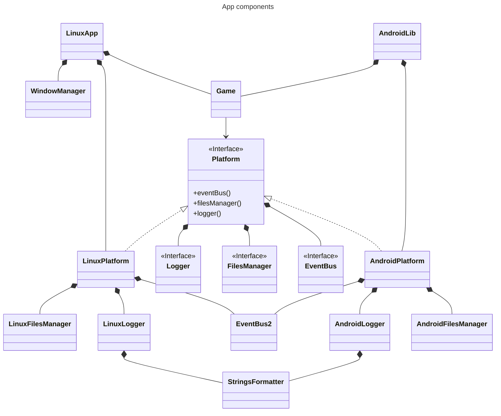

# App components

```mermaid
---
title: App components
---
classDiagram
direction BT
  WindowManager --* LinuxApp
  LinuxPlatform --* LinuxApp
  Game --* LinuxApp
  Game --* AndroidLib
  AndroidPlatform --* AndroidLib

  EventBus2 --* AndroidPlatform
  AndroidLogger --* AndroidPlatform
  AndroidFilesManager --* AndroidPlatform
  Platform <-- Game
  LinuxFilesManager --* LinuxPlatform
  LinuxLogger --* LinuxPlatform
  EventBus2 --* LinuxPlatform

  StringsFormatter --* LinuxLogger
  StringsFormatter --* AndroidLogger
  LinuxPlatform ..|> Platform
  Logger --* Platform
  FilesManager --* Platform
  EventBus --* Platform
  AndroidPlatform ..|> Platform

  <<Interface>> Logger
  <<Interface>> EventBus
  <<Interface>> FilesManager

  class Platform {
  <<Interface>>
        +eventBus()
        +filesManager()
        +logger()
    }
```
